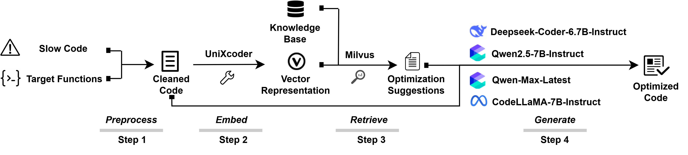

<div align="center">
  <h1 align="center">FasterPy: An Execution Efficiency Optimization Framework for LLM-Generated Code</h1>
</div>

<div align="center">
    <a href="https://github.com/WuYue22/FasterPy">
        
    </a>
    <a href="https://huggingface.co/datasets/YueWu2/code-opt-knowledge/tree/main">
        
    </a>
    <a href="">
        
    </a>
    <hr>
</div>

# FasterPy
**FasterPy** is a framework designed to optimize the code execution efficiency of LLMs-generated python code.
By combining retrieval-augmented generation (RAG) with low-rank fine-tuning, 
the framework adaptively enhances large language models (LLMs) for code efficiency optimization tasks.


## ✨ Features
- **Retrieval-Augmented Generation**: We built a knowledge base containing over 6w entries to retrieve code optimization suggestions.
- **Low-Rank Adaptation (LoRA)**: We performed low-rank fine-tuning of the LLMs using the slow codes and the retrieved optimization suggestions.
- **Improved PIE Benchmarking Program**: We present an enhanced version of the PIE Benchmarking Program, achieving an improvement in evaluation efficiency.

[//]: # ()

------
## 🚀 Quick Start

### Environment Setup
Follow these steps to set up the environment for FasterPy:
```shell
conda create -n fsp python=3.11
conda activate fsp
pip install -r requirements.txt
```
### Data Preparation
**1.Knowledge Base**

We provide the dataset **OD-base.jsonl**, which is required for the optimization suggestions knowledge base, at
[this url](https://huggingface.co/datasets/YueWu2/code-opt-knowledge/tree/main).
Each file is a jsonl:
```json
{
  "input": "(string)the column name for the slow code",
  "target": "(string)the column name for the faster code",
  "diff": "(string)the differences between input and target, representing in the unified diff style.",
  "rate": "(float)execution efficiency improvement rate",
  "summary": "(string)natural language summary of code execution efficiency optimization related to the slow_code",
  "vector": "(string)768-dimensional vector representation obtained from embedding the input"
}
```
After downloading, please place it in the `dataset/knowledge-base` directory.

You can also build it yourself.
Run `py dataset/package.py` to convert a dataset containing the `diff` field into a format suitable for batch summary generation,
and then run `py dataset/generate_summary.py` to batch-generate code optimization summaries (`summary`).
Run `py dataset/vector_generate.py` to batch embed the code in the `input` field into vectors and save them to the `vector` field.

**2.Train dataset**

We provide the training dataset **train\_data\_msg.jsonl** in the `dataset/train-data` directory for performing low-rank fine-tuning on the LLMs.
You can also build it yourself, but please ensure it is in **message** format.
We provide the script `convert_to_message.py` to convert a dataset containing the `input`, `target`, and `suggestions` fields into **message** format.

**3.Evaluation Dataset**

We adopt the official test split of the PIE dataset (Python subset) as the basis for model evaluation.
It contains fields: `problem\_id`, `slow\_code\_col`, `reference\_code\_col` (manual high-performance solution), and `model\_generated\_potentially\_faster\_code\_col` (an empty field intended to store the model-generated result).

Notably, we removed any samples exhibiting missing or incompatible packages, runtime errors, or mismatches between the program output and
the expected results defined by the test cases.
After filtering, the evaluation dataset consists of **752 test instances** that can stably run and produce correct outputs under the current environment 

### Model Fine-tuning
Use the following command to download the model into the `models` directory:
```shell
huggingface-cli download --resume-download Qwen/Qwen2.5-7B-Instruct --local-dir /models
```
Then run the following command to fine-tune the model:
```shell
py train/train.py
```

### Start FasterPy
On the first run, execute the following command to import the knowledge base into the vector database:
```shell
py knowledge-base/import_data.py
```
Run the following command to start FasterPy:
```shell
py pipeline/main.py [-modelpath ./my_model]
```

For easier evaluation, we provide the script `generate.py` for batch generation of optimized code.
Prepare a jsonl file in the following format:
```json
{
  "problem_id":"p03371",
  "slow_code_col":"the column name for the input code to be optimized",
  "model_generated_potentially_faster_code_col":"slow_code_col after applying awesome_optimization. This is the code that will be evaluated.",
  "suggestion":"[{'text': 'suggestion in natural language', 'rate': (float)optimization rate, 'distance': (float)distance}, {'text': 'suggestion2', 'rate': (float), 'distance': (float)}]"
}
```

Then run the following command to perform batch generation:
```
py train/generate.py
```
The generated optimized code will be filled into the `model_generated_potentially_faster_code_col` field.

------
## 📊 Evaluation
We modified the evaluation code from [madaan/pie-perf: Training language models to make programs faster](https://github.com/madaan/pie-perf), and the usage is similar.

1. Save the generations in a jsonl file with the following fields:
```js
{
    "slow_code_col": "the column name for the input code",
    "model_generated_potentially_faster_code_col": "slow_code_col after applying awesome_optimization. This is the code that will be evaluated. You can also provide a list of different candidates here, and the evaluation will be done for each candidate"
}
```

2. Next, we need to provide the path to the file with some metadata. We call it the `reference_file` but providing references are optional. The main purpose of this file is to provide information like the language of the code, the problem id, etc. The file should have `slow_code_col` (same as the generations file) and `problem_id`. We join the generations file and the references file on the `slow_code_col` to get the problem id.

3. Finally, we need to provide the path to the file with the actual test cases. We call it the inputs_outputs_basepath. This is a directory with the following structure:
```
inputs_outputs_basepath/{problem_id}/{inputs, outputs}.txt
```
where `{inputs, outputs}.txt` are the input and output files for the problem with id `problem_id`. The input and output are plain text files. Each program is fed `inputs.txt` and the output is compared with `outputs.txt`.
4. In addition to these, we need to provide some information about the run. Specifically, the number of times each program should be run, the number of programs to evaluate, the timeout, and so on.

We wrap all of this information is provided in a yaml file `sample_eval_config.yaml`. Here is an example:
```yaml
model_generated_outputs_path: "to_be_eval/test-qw2.5-7b-i.jsonl"
inputs_outputs_basepath: "codenet/public_test_cases"
reference_file_path: "py_reference.jsonl"
output_report_file_path: "eval-results/test-qw2.5-7b-i-report.jsonl"
language: "python"
num_problems_to_evaluate: -1
num_trials: 4
ignore_first_k: 1
max_time_per_run: 3
temp_dir: null
model_generated_potentially_faster_code_col: "model_generated_potentially_faster_code_col"
slow_code_col: "slow_code_col"
reference_code_col: "reference_code_col"
is_prompt_based: false
cpu_number: 1
```
5. Finally, we can run the evaluation. We provide a script for this: `src/codenet_eval/run_eval.py`. The script takes the yaml file as input. Here is an example:

```bash
python src/codenet_eval/run_eval.py --eval_config eval/sample_eval_config.yaml
```
------
## 📋 Repository Structure
Here we explain each part of this repo.

```plaintext
├── data-collection             # Tools for cleaning, merging and generating dataset; currently unfinished, and we will continue development in the future
├── dataset                     # Dataset for training and scripts for preprocessing dataset
├── doc                         # Assets for the README
├── eval                        # Scripts for evaluating this framework and evaluation results
│ ├── eval-results              # Evaluation results of this framework 
│ ├── src                       # Evaluation scripts
│ ├── to_be_eval                # Generated optimized code results to be evaluated
│ ├── sample_eval_config.yaml   # Sample evaluation config
│ └── others                    # Other evaluation scripts, currently unfinished
├── knowledge                   # Code related to Retrieval-Augmented Generation (RAG)
├── pipeline                    # The framework itself
├── train                       # Code for training the model and generate use this model
├── README.md                   # Description of this replication package
├── config.json                 # Project configuration file (paths, hyperparameters, settings)
└── requirements.txt            # Python package dependencies
```

## 📝 Citation

```bibtex
@article{Wu2025FasterPy,
  author = {Wu, Yue and Han, Minghao and Liang, Peng},
  title = {{FasterPy: An Execution Efficiency Optimization Framework for LLM-Generated Code}},
  journal={arXiv preprint arXiv:xxxx.xxxxx},
  year={2025}
}
```
